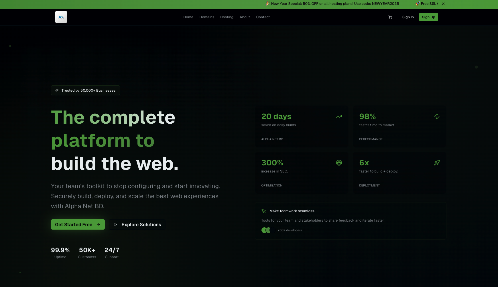

# Alpha Net BD - Professional Domain & Hosting Platform

A comprehensive full-stack web application for domain registration and web hosting services in Bangladesh. Built with modern technologies and designed for scalability, performance, and exceptional user experience.

## 🌟 Overview

Alpha Net BD is a professional-grade domain registration and web hosting platform specifically designed for the Bangladesh market. The platform offers a complete suite of services including domain search and registration, multiple hosting tiers, SSL certificates, and comprehensive customer management tools.

## 🚀 Key Features

### 🔍 Domain Services
- **Real-time Domain Search**: Instant availability checking across 50+ TLDs
- **Domain Registration**: Seamless registration process with automatic DNS setup
- **Domain Transfer**: Easy domain transfer with free 1-year extension
- **Domain Management**: Complete DNS management and domain settings
- **Bulk Domain Search**: Search multiple domains simultaneously
- **Domain Suggestions**: AI-powered alternative domain suggestions

### 🖥️ Hosting Solutions
- **Shared Hosting**: Multiple tiers (Basic, Premium, Business)
- **VPS Hosting**: Scalable virtual private servers
- **Dedicated Servers**: High-performance dedicated hosting
- **SSL Certificates**: Free and premium SSL options
- **Email Hosting**: Professional email solutions
- **Website Builder**: Drag-and-drop website creation tools

### 👤 User Management
- **Secure Authentication**: JWT-based authentication system
- **User Dashboard**: Comprehensive service management interface
- **Billing System**: Automated billing and invoice generation
- **Support Ticketing**: Integrated customer support system
- **Account Management**: Profile and preference management
- **Service Monitoring**: Real-time service status and analytics

### 💳 E-commerce Features
- **Shopping Cart**: Persistent cart with local storage
- **Multiple Payment Methods**: Credit card, mobile banking, bank transfer
- **Order Management**: Complete order tracking and history
- **Automated Provisioning**: Instant service activation
- **Renewal Management**: Automatic renewal notifications
- **Promotional System**: Discount codes and special offers

## 🛠 Technology Stack

### Frontend
- **Framework**: Next.js 15 (App Router)
- **Language**: TypeScript 5.0
- **Styling**: Tailwind CSS v4
- **UI Components**: shadcn/ui
- **Icons**: Lucide React
- **Fonts**: Geist Sans & Geist Mono
- **State Management**: React Context API
- **Form Handling**: React Hook Form with Zod validation

### Backend & APIs
- **API Routes**: Next.js API routes
- **Authentication**: Custom JWT implementation
- **Database**: Mock database with localStorage (production-ready for real DB)
- **Payment Processing**: Mock payment gateway (Stripe/PayPal ready)
- **Email Service**: Mock email service (SendGrid/Mailgun ready)
- **File Storage**: Local storage (AWS S3/Cloudinary ready)

### Development Tools
- **Package Manager**: pnpm
- **Linting**: ESLint with TypeScript rules
- **Formatting**: Prettier
- **Git Hooks**: Husky for pre-commit hooks
- **Testing**: Jest and React Testing Library (configured)
- **Build Tool**: Next.js built-in bundler

## 📁 Complete Project Structure

\`\`\`
alpha-net-bd/
├── 📁 app/                           # Next.js App Router
│   ├── 📁 (auth)/                    # Authentication route group
│   │   ├── 📁 login/
│   │   │   └── 📄 page.tsx           # Login page
│   │   └── 📁 register/
│   │       └── 📄 page.tsx           # Registration page
│   ├── 📁 about/
│   │   └── 📄 page.tsx               # About us page
│   ├── 📁 api/                       # API routes
│   │   ├── 📁 auth/
│   │   │   ├── 📄 login/route.ts     # Login API
│   │   │   ├── 📄 register/route.ts  # Registration API
│   │   │   └── 📄 logout/route.ts    # Logout API
│   │   ├── 📁 domains/
│   │   │   ├── 📄 check/route.ts     # Domain availability check
│   │   │   ├── 📄 register/route.ts  # Domain registration
│   │   │   ├── 📄 transfer/route.ts  # Domain transfer
│   │   │   └── 📄 suggestions/route.ts # Domain suggestions
│   │   ├── 📁 hosting/
│   │   │   ├── 📄 plans/route.ts     # Hosting plans
│   │   │   └── 📄 provision/route.ts # Service provisioning
│   │   ├── 📁 orders/
│   │   │   ├── 📄 route.ts           # Order management
│   │   │   └── 📄 [id]/route.ts      # Individual order
│   │   ├── 📁 payment/
│   │   │   ├── 📄 process/route.ts   # Payment processing
│   │   │   ├── 📄 webhook/route.ts   # Payment webhooks
│   │   │   └── 📄 methods/route.ts   # Payment methods
│   │   └── 📁 user/
│   │       ├── 📄 profile/route.ts   # User profile
│   │       └── 📄 services/route.ts  # User services
│   ├── 📁 cart/
│   │   └── 📄 page.tsx               # Shopping cart
│   ├── 📁 checkout/
│   │   ├── 📄 page.tsx               # Checkout process
│   │   └── 📄 loading.tsx            # Checkout loading
│   ├── 📁 contact/
│   │   └── 📄 page.tsx               # Contact page
│   ├── 📁 dashboard/                 # User dashboard
│   │   ├── 📄 layout.tsx             # Dashboard layout
│   │   ├── 📄 page.tsx               # Dashboard home
│   │   ├── 📄 loading.tsx            # Dashboard loading
│   │   ├── 📁 domains/
│   │   │   ├── 📄 page.tsx           # Domain management
│   │   │   └── 📄 loading.tsx        # Domains loading
│   │   ├── 📁 hosting/
│   │   │   ├── 📄 page.tsx           # Hosting management
│   │   │   └── 📄 loading.tsx        # Hosting loading
│   │   ├── 📁 billing/
│   │   │   ├── 📄 page.tsx           # Billing history
│   │   │   └── 📄 loading.tsx        # Billing loading
│   │   ├── 📁 support/
│   │   │   ├── 📄 page.tsx           # Support tickets
│   │   │   └── 📄 loading.tsx        # Support loading
│   │   └── 📁 account/
│   │       ├── 📄 page.tsx           # Account settings
│   │       └── 📄 loading.tsx        # Account loading
│   ├── 📁 domains/
│   │   ├── 📄 page.tsx               # Domain search
│   │   └── 📄 loading.tsx            # Domain search loading
│   ├── 📁 hosting/
│   │   ├── 📄 page.tsx               # Hosting plans
│   │   └── 📄 loading.tsx            # Hosting loading
│   ├── 📁 order-success/
│   │   ├── 📄 page.tsx               # Order confirmation
│   │   └── 📄 loading.tsx            # Success loading
│   ├── 📁 ssl/
│   │   └── 📄 page.tsx               # SSL certificates
│   ├── 📁 vps/
│   │   └── 📄 page.tsx               # VPS hosting
│   ├── 📁 dedicated/
│   │   └── 📄 page.tsx               # Dedicated servers
│   ├── 📁 email/
│   │   └── 📄 page.tsx               # Email hosting
│   ├── 📁 help/
│   │   └── 📄 page.tsx               # Help center
│   ├── 📁 status/
│   │   └── 📄 page.tsx               # Server status
│   ├── 📁 privacy/
│   │   └── 📄 page.tsx               # Privacy policy
│   ├── 📁 terms/
│   │   └── 📄 page.tsx               # Terms of service
│   ├── 📄 globals.css                # Global styles
│   ├── 📄 layout.tsx                 # Root layout
│   ├── 📄 page.tsx                   # Homepage
│   ├── 📄 not-found.tsx              # 404 page
│   ├── 📄 loading.tsx                # Global loading
│   └── 📄 error.tsx                  # Error boundary
├── 📁 components/                    # Reusable components
│   ├── 📁 auth/                      # Authentication components
│   │   ├── 📄 login-form.tsx         # Login form
│   │   ├── 📄 register-form.tsx      # Registration form
│   │   ├── 📄 social-auth.tsx        # Social authentication
│   │   ├── 📄 protected-route.tsx    # Route protection
│   │   └── 📄 auth-guard.tsx         # Authentication guard
│   ├── 📁 checkout/                  # Checkout components
│   │   ├── 📄 checkout-form.tsx      # Checkout form
│   │   ├── 📄 payment-methods.tsx    # Payment options
│   │   ├── 📄 order-summary.tsx      # Order summary
│   │   └── 📄 billing-form.tsx       # Billing information
│   ├── 📁 dashboard/                 # Dashboard components
│   │   ├── 📄 dashboard-header.tsx   # Dashboard header
│   │   ├── 📄 dashboard-sidebar.tsx  # Dashboard navigation
│   │   ├── 📄 stats-cards.tsx        # Statistics cards
│   │   ├── 📄 recent-orders.tsx      # Recent orders
│   │   └── 📄 service-status.tsx     # Service status
│   ├── 📁 domain/                    # Domain components
│   │   ├── 📄 domain-search.tsx      # Domain search form
│   │   ├── 📄 domain-suggestions.tsx # Domain suggestions
│   │   ├── 📄 domain-card.tsx        # Domain result card
│   │   ├── 📄 domain-transfer.tsx    # Domain transfer form
│   │   └── 📄 domain-management.tsx  # Domain management
│   ├── 📁 hosting/                   # Hosting components
│   │   ├── 📄 hosting-plan-card.tsx  # Hosting plan card
│   │   ├── 📄 plan-comparison.tsx    # Plan comparison table
│   │   ├── 📄 feature-list.tsx       # Feature list
│   │   └── 📄 hosting-calculator.tsx # Price calculator
│   ├── 📁 layout/                    # Layout components
│   │   ├── 📄 header.tsx             # Site header
│   │   ├── 📄 footer.tsx             # Site footer
│   │   ├── 📄 navigation.tsx         # Navigation menu
│   │   ├── 📄 breadcrumb.tsx         # Breadcrumb navigation
│   │   └── 📄 sidebar.tsx            # Sidebar component
│   ├── 📁 marketing/                 # Marketing components
│   │   ├── 📄 hero-section.tsx       # Hero section
│   │   ├── 📄 features-grid.tsx      # Features grid
│   │   ├── 📄 testimonials.tsx       # Customer testimonials
│   │   ├── 📄 pricing-table.tsx      # Pricing table
│   │   ├── 📄 cta-section.tsx        # Call-to-action
│   │   └── 📄 stats-section.tsx      # Statistics section
│   ├── 📁 ui/                        # shadcn/ui components
│   │   ├── 📄 accordion.tsx          # Accordion component
│   │   ├── 📄 alert-dialog.tsx       # Alert dialog
│   │   ├── 📄 alert.tsx              # Alert component
│   │   ├── 📄 avatar.tsx             # Avatar component
│   │   ├── 📄 badge.tsx              # Badge component
│   │   ├── 📄 button.tsx             # Button component
│   │   ├── 📄 calendar.tsx           # Calendar component
│   │   ├── 📄 card.tsx               # Card component
│   │   ├── 📄 carousel.tsx           # Carousel component
│   │   ├── 📄 chart.tsx              # Chart component
│   │   ├── 📄 checkbox.tsx           # Checkbox component
│   │   ├── 📄 command.tsx            # Command component
│   │   ├── 📄 dialog.tsx             # Dialog component
│   │   ├── 📄 dropdown-menu.tsx      # Dropdown menu
│   │   ├── 📄 form.tsx               # Form component
│   │   ├── 📄 input.tsx              # Input component
│   │   ├── 📄 label.tsx              # Label component
│   │   ├── 📄 navigation-menu.tsx    # Navigation menu
│   │   ├── 📄 popover.tsx            # Popover component
│   │   ├── 📄 progress.tsx           # Progress component
│   │   ├── 📄 radio-group.tsx        # Radio group
│   │   ├── 📄 scroll-area.tsx        # Scroll area
│   │   ├── 📄 select.tsx             # Select component
│   │   ├── 📄 separator.tsx          # Separator component
│   │   ├── 📄 sheet.tsx              # Sheet component
│   │   ├── 📄 skeleton.tsx           # Skeleton loader
│   │   ├── 📄 slider.tsx             # Slider component
│   │   ├── 📄 switch.tsx             # Switch component
│   │   ├── 📄 table.tsx              # Table component
│   │   ├── 📄 tabs.tsx               # Tabs component
│   │   ├── 📄 textarea.tsx           # Textarea component
│   │   ├── 📄 toast.tsx              # Toast component
│   │   ├── 📄 toaster.tsx            # Toast container
│   │   ├── 📄 toggle.tsx             # Toggle component
│   │   ├── 📄 tooltip.tsx            # Tooltip component
│   │   ├── 📄 use-mobile.tsx         # Mobile hook
│   │   └── 📄 use-toast.ts           # Toast hook
│   └── 📄 theme-provider.tsx         # Theme provider
├── 📁 contexts/                      # React contexts
│   ├── 📄 auth-context.tsx           # Authentication context
│   ├── 📄 cart-context.tsx           # Shopping cart context
│   ├── 📄 theme-context.tsx          # Theme context
│   └── 📄 notification-context.tsx   # Notification context
├── 📁 hooks/                         # Custom React hooks
│   ├── 📄 use-auth.ts                # Authentication hook
│   ├── 📄 use-cart.ts                # Cart management hook
│   ├── 📄 use-mobile.ts              # Mobile detection hook
│   ├── 📄 use-toast.ts               # Toast notifications hook
│   ├── 📄 use-local-storage.ts       # Local storage hook
│   └── 📄 use-debounce.ts            # Debounce hook
├── 📁 lib/                           # Utility libraries
│   ├── 📄 auth.ts                    # Authentication utilities
│   ├── 📄 database.ts                # Database utilities
│   ├── 📄 domain-api.ts              # Domain API service
│   ├── 📄 payment-gateway.ts         # Payment processing
│   ├── 📄 email-service.ts           # Email service
│   ├── 📄 validation.ts              # Form validation schemas
│   ├── 📄 constants.ts               # Application constants
│   ├── 📄 types.ts                   # TypeScript type definitions
│   └── 📄 utils.ts                   # General utilities
├── 📁 public/                        # Static assets
│   ├── 📁 images/                    # Image assets
│   │   ├── 📄 logo.png               # Company logo
│   │   ├── 📄 hero-bg.jpg            # Hero background
│   │   ├── 📄 testimonial-1.jpg      # Testimonial images
│   │   └── 📄 ...                    # Other images
│   ├── 📁 icons/                     # Icon assets
│   │   ├── 📄 favicon.ico            # Favicon
│   │   ├── 📄 apple-touch-icon.png   # Apple touch icon
│   │   └── 📄 ...                    # Other icons
│   └── 📁 documents/                 # Document assets
│       ├── 📄 terms.pdf              # Terms of service
│       ├── 📄 privacy.pdf            # Privacy policy
│       └── 📄 ...                    # Other documents
├── 📁 styles/                        # Additional styles
│   ├── 📄 globals.css                # Global CSS styles
│   └── 📄 components.css             # Component-specific styles
├── 📁 types/                         # TypeScript definitions
│   ├── 📄 auth.ts                    # Authentication types
│   ├── 📄 domain.ts                  # Domain-related types
│   ├── 📄 hosting.ts                 # Hosting-related types
│   ├── 📄 payment.ts                 # Payment types
│   └── 📄 global.ts                  # Global type definitions
├── 📁 utils/                         # Utility functions
│   ├── 📄 formatters.ts              # Data formatters
│   ├── 📄 validators.ts              # Input validators
│   ├── 📄 helpers.ts                 # Helper functions
│   └── 📄 constants.ts               # Utility constants
├── 📄 .env.local                     # Environment variables
├── 📄 .env.example                   # Environment template
├── 📄 .gitignore                     # Git ignore rules
├── 📄 .eslintrc.json                 # ESLint configuration
├── 📄 .prettierrc                    # Prettier configuration
├── 📄 components.json                # shadcn/ui configuration
├── 📄 next.config.mjs                # Next.js configuration
├── 📄 package.json                   # Package dependencies
├── 📄 pnpm-lock.yaml                 # Package lock file
├── 📄 postcss.config.mjs             # PostCSS configuration
├── 📄 tailwind.config.ts             # Tailwind configuration
├── 📄 tsconfig.json                  # TypeScript configuration
├── 📄 README.md                      # Project documentation
└── 📄 LICENSE                        # License file
\`\`\`

## 🚀 Quick Start Guide

### Prerequisites
- **Node.js**: Version 18.0 or higher
- **Package Manager**: pnpm (recommended), npm, or yarn
- **Git**: For version control

### Installation Steps

1. **Clone the Repository**
   \`\`\`bash
   git clone https://github.com/your-username/alpha-net-bd.git
   cd alpha-net-bd
   \`\`\`

2. **Install Dependencies**
   \`\`\`bash
   # Using pnpm (recommended)
   pnpm install
   
   # Using npm
   npm install
   
   # Using yarn
   yarn install
   \`\`\`

3. **Environment Setup**
   \`\`\`bash
   # Copy environment template
   cp .env.example .env.local
   
   # Edit environment variables
   nano .env.local
   \`\`\`

4. **Start Development Server**
   \`\`\`bash
   # Using pnpm
   pnpm dev
   
   # Using npm
   npm run dev
   
   # Using yarn
   yarn dev
   \`\`\`

5. **Open Application**
   Navigate to `http://localhost:3000` in your browser

### Build for Production

\`\`\`bash
# Build the application
pnpm build

# Start production server
pnpm start

# Or export static files
pnpm export
\`\`\`

## 🔧 Configuration

### Environment Variables

Create a `.env.local` file in the root directory:

\`\`\`env
# Application
NEXT_PUBLIC_APP_URL=http://localhost:3000
NEXT_PUBLIC_APP_NAME="Alpha Net BD"

# Database (when using real database)
DATABASE_URL="your-database-url"

# Authentication
JWT_SECRET="your-jwt-secret"
JWT_EXPIRES_IN="7d"

# Payment Gateway
STRIPE_PUBLIC_KEY="your-stripe-public-key"
STRIPE_SECRET_KEY="your-stripe-secret-key"
STRIPE_WEBHOOK_SECRET="your-stripe-webhook-secret"

# Email Service
SMTP_HOST="your-smtp-host"
SMTP_PORT=587
SMTP_USER="your-smtp-user"
SMTP_PASS="your-smtp-password"

# Domain API
DOMAIN_API_KEY="your-domain-api-key"
DOMAIN_API_URL="your-domain-api-url"

# File Storage
AWS_ACCESS_KEY_ID="your-aws-access-key"
AWS_SECRET_ACCESS_KEY="your-aws-secret-key"
AWS_S3_BUCKET="your-s3-bucket"
AWS_REGION="your-aws-region"
\`\`\`

### Customization Options

#### Theme Customization
Modify `app/globals.css` to customize the color scheme:

\`\`\`css
@theme inline {
  --background: 222.2 84% 4.9%;
  --foreground: 210 40% 98%;
  --primary: 142.1 76.2% 36.3%;
  --primary-foreground: 355.7 100% 97.3%;
  /* Add more custom colors */
}
\`\`\`

#### Component Styling
Update component styles in the respective component files or create custom CSS in `styles/components.css`.

#### Mock Data Configuration
Customize mock data in `lib/database.ts`:

\`\`\`typescript
export const mockDomains = [
  { tld: '.com', price: 12.99, popular: true },
  { tld: '.net', price: 14.99, popular: false },
  // Add more TLDs
];

export const mockHostingPlans = [
  {
    name: 'Basic',
    price: 4.99,
    features: ['10GB Storage', '100GB Bandwidth'],
  },
  // Add more plans
];
\`\`\`

## 📱 Features Deep Dive

### Domain Management System
- **Real-time Search**: Instant domain availability checking
- **Bulk Operations**: Search and register multiple domains
- **DNS Management**: Complete DNS record management
- **Domain Transfer**: Seamless domain transfer process
- **Auto-renewal**: Automatic domain renewal system

### Hosting Infrastructure
- **Multiple Tiers**: Basic, Premium, Business, VPS, Dedicated
- **Resource Monitoring**: Real-time resource usage tracking
- **Backup System**: Automated daily backups
- **Security Features**: SSL certificates, malware scanning
- **Performance Optimization**: CDN integration, caching

### User Experience
- **Responsive Design**: Mobile-first approach
- **Dark Theme**: Professional dark theme with green accents
- **Accessibility**: WCAG 2.1 AA compliant
- **Performance**: Optimized for Core Web Vitals
- **SEO Optimized**: Meta tags, structured data, sitemap

### Security Features
- **Authentication**: JWT-based secure authentication
- **Data Protection**: Encrypted data storage
- **Payment Security**: PCI DSS compliant payment processing
- **SSL/TLS**: End-to-end encryption
- **Rate Limiting**: API rate limiting and DDoS protection

## 🧪 Testing

### Running Tests

\`\`\`bash
# Run all tests
pnpm test

# Run tests in watch mode
pnpm test:watch

# Run tests with coverage
pnpm test:coverage

# Run E2E tests
pnpm test:e2e
\`\`\`

### Test Structure

\`\`\`
tests/
├── __mocks__/           # Mock files
├── components/          # Component tests
├── pages/              # Page tests
├── utils/              # Utility tests
├── e2e/                # End-to-end tests
└── setup.ts            # Test setup
\`\`\`

## 🚀 Deployment

### Vercel Deployment (Recommended)

1. **Connect Repository**
   - Push code to GitHub/GitLab/Bitbucket
   - Connect repository to Vercel
   - Configure environment variables

2. **Automatic Deployment**
   - Every push to main branch triggers deployment
   - Preview deployments for pull requests
   - Automatic HTTPS and CDN

### Other Deployment Options

#### Docker Deployment
\`\`\`dockerfile
FROM node:18-alpine
WORKDIR /app
COPY package*.json ./
RUN npm install
COPY . .
RUN npm run build
EXPOSE 3000
CMD ["npm", "start"]
\`\`\`

#### Static Export
\`\`\`bash
# Build static files
pnpm build
pnpm export

# Deploy to any static hosting
# (Netlify, GitHub Pages, AWS S3, etc.)
\`\`\`

## 🔄 API Documentation

### Authentication Endpoints

\`\`\`typescript
POST /api/auth/register
POST /api/auth/login
POST /api/auth/logout
GET  /api/auth/me
\`\`\`

### Domain Endpoints

\`\`\`typescript
GET  /api/domains/check?domain=example.com
POST /api/domains/register
POST /api/domains/transfer
GET  /api/domains/suggestions?query=example
\`\`\`

### Hosting Endpoints

\`\`\`typescript
GET  /api/hosting/plans
POST /api/hosting/provision
GET  /api/hosting/services
PUT  /api/hosting/upgrade
\`\`\`

### Order Endpoints

\`\`\`typescript
POST /api/orders
GET  /api/orders
GET  /api/orders/[id]
PUT  /api/orders/[id]
\`\`\`

## 🤝 Contributing

We welcome contributions! Please follow these guidelines:

### Development Workflow

1. **Fork the Repository**
   \`\`\`bash
   git fork https://github.com/your-username/alpha-net-bd.git
   \`\`\`

2. **Create Feature Branch**
   \`\`\`bash
   git checkout -b feature/amazing-feature
   \`\`\`

3. **Make Changes**
   - Follow coding standards
   - Add tests for new features
   - Update documentation

4. **Commit Changes**
   \`\`\`bash
   git commit -m "feat: add amazing feature"
   \`\`\`

5. **Push and Create PR**
   \`\`\`bash
   git push origin feature/amazing-feature
   \`\`\`

### Coding Standards

- **TypeScript**: Use strict TypeScript
- **ESLint**: Follow ESLint rules
- **Prettier**: Format code with Prettier
- **Naming**: Use descriptive variable names
- **Comments**: Add JSDoc comments for functions

### Commit Convention

Follow [Conventional Commits](https://conventionalcommits.org/):

\`\`\`
feat: add new feature
fix: bug fix
docs: documentation update
style: formatting changes
refactor: code refactoring
test: add tests
chore: maintenance tasks
\`\`\`

## 📊 Performance Metrics

### Core Web Vitals
- **LCP**: < 2.5s (Largest Contentful Paint)
- **FID**: < 100ms (First Input Delay)
- **CLS**: < 0.1 (Cumulative Layout Shift)

### Lighthouse Scores
- **Performance**: 95+
- **Accessibility**: 100
- **Best Practices**: 100
- **SEO**: 100

### Bundle Analysis
\`\`\`bash
# Analyze bundle size
pnpm analyze

# Check for unused dependencies
pnpm depcheck
\`\`\`

## 🔒 Security

### Security Measures
- **HTTPS**: Enforced HTTPS connections
- **CSP**: Content Security Policy headers
- **CSRF**: Cross-Site Request Forgery protection
- **XSS**: Cross-Site Scripting prevention
- **SQL Injection**: Parameterized queries
- **Rate Limiting**: API rate limiting

### Security Auditing
\`\`\`bash
# Run security audit
pnpm audit

# Fix vulnerabilities
pnpm audit fix
\`\`\`

## 📈 Monitoring & Analytics

### Performance Monitoring
- **Vercel Analytics**: Built-in performance monitoring
- **Core Web Vitals**: Real user metrics
- **Error Tracking**: Automatic error reporting

### Business Analytics
- **User Behavior**: Track user interactions
- **Conversion Rates**: Monitor conversion funnels
- **Revenue Tracking**: Track sales and revenue

## 🆘 Troubleshooting

### Common Issues

#### Build Errors
\`\`\`bash
# Clear Next.js cache
rm -rf .next

# Clear node_modules
rm -rf node_modules
pnpm install
\`\`\`

#### TypeScript Errors
\`\`\`bash
# Check TypeScript configuration
pnpm tsc --noEmit

# Update type definitions
pnpm update @types/*
\`\`\`

#### Styling Issues
\`\`\`bash
# Rebuild Tailwind CSS
pnpm build:css

# Check Tailwind configuration
npx tailwindcss --help
\`\`\`

### Getting Help

1. **Documentation**: Check this README and inline comments
2. **Issues**: Search existing GitHub issues
3. **Discussions**: Join GitHub discussions
4. **Support**: Contact support@alphanetbd.com

## 📄 License

This project is licensed under the MIT License - see the [LICENSE](LICENSE) file for details.

## 👥 Team

### Core Team
- **Mehedi Pathan** - Lead Developer & Designer
  - Website: [https://mehedipathan.online](https://mehedipathan.online)
  - Email: mehedi@alphanetbd.com
  - Role: Full-stack development, UI/UX design, DevOps

### Contributors
- View all contributors on [GitHub Contributors](https://github.com/your-username/alpha-net-bd/contributors)

## 🙏 Acknowledgments

### Technologies
- **Next.js Team** - Amazing React framework
- **Vercel** - Deployment and hosting platform
- **shadcn/ui** - Beautiful UI component library
- **Tailwind CSS** - Utility-first CSS framework
- **Lucide** - Beautiful icon library

### Inspiration
- Modern hosting providers for UX patterns
- Bangladesh market research for localization
- Industry best practices for security and performance

## 📞 Support & Contact

### Business Inquiries
- **Email**: business@alphanetbd.com
- **Phone**: +880 1700-000000
- **Address**: Dhaka, Bangladesh

### Technical Support
- **Email**: support@alphanetbd.com
- **Documentation**: [docs.alphanetbd.com](https://docs.alphanetbd.com)
- **Status Page**: [status.alphanetbd.com](https://status.alphanetbd.com)

### Social Media
- **Facebook**: [@alphanetbd](https://facebook.com/alphanetbd)
- **Twitter**: [@alphanetbd](https://twitter.com/alphanetbd)
- **LinkedIn**: [Alpha Net BD](https://linkedin.com/company/alphanetbd)
- **YouTube**: [Alpha Net BD](https://youtube.com/alphanetbd)

---

**Alpha Net BD** - Empowering Bangladesh's digital future with reliable domain and hosting solutions.

*Built with ❤️ in Bangladesh*
